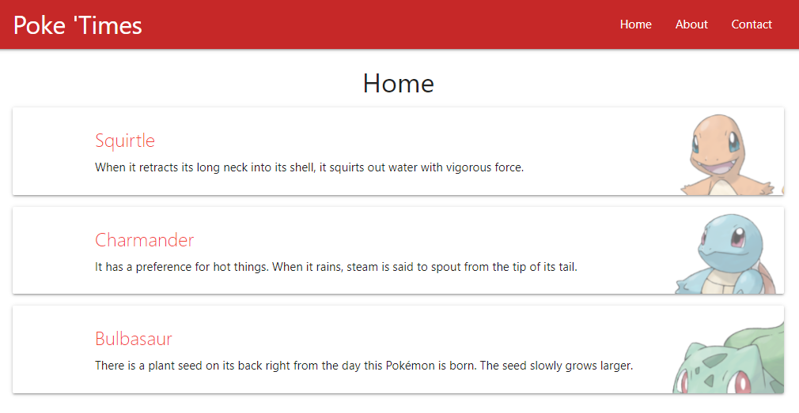

<h1 align="center">[React Toy Project] Pokemon Dictionary</h1>

Toy Clone project using React, courtesy of *The Net Ninja*.
 

This website shows a list of Pokémons. 
- Click on each post to see the detail or delete the post. 
- Check the About page, which changes color each time you refresh!

간단한 포켓몬 도감입니다.
- Home 페이지에서 포켓몬을 눌러 설명을 보거나 포켓몬을 지우세요.
- About 페이지는 새로고침할 때마다 색이 바뀝니다. 확인해보세요!

✔️ Created `2021-08-08` 
✔️ Using `React` 

 

  

## Install

To host the website on local server:
1. Clone the repository.
2. `npm i` ➔ `npm start`